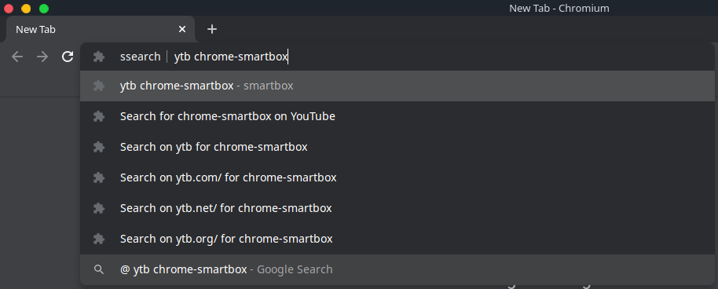
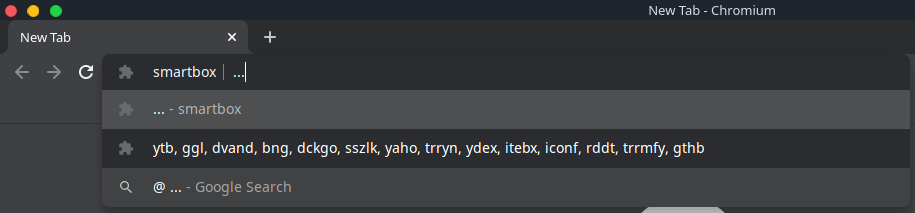
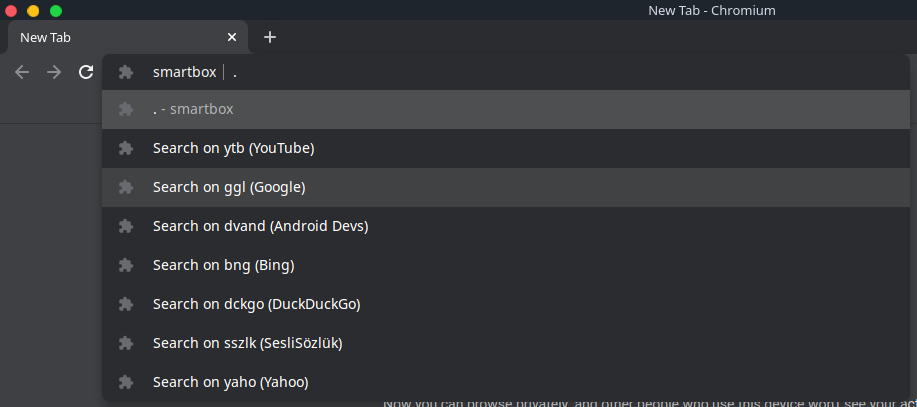

# smartbox

`smartbox v4.7`

An unmatched searching tool for web browsers, search for
anything you want, search on anywhere you want.

## Available Search Engines & Keywords

| Platform           | Keyword   |
|:-------------------|:---------:|
| YouTube            | ytb       |
| Google             | ggl       |
| Android Developers | adox      |
| Bing               | bng       |
| DuckDuckGo         | dckgo     |
| Yahoo              | yaho      |
| Iconfinder         | iconf     |
| Reddit             | rddt      |
| GitHub             | gthb      |

## Screenshots





## Usage

### JSON data

```json
[
    {
        "name": "xmpl",
        "desc": "example",
        "url": "https://example.com/search/?q=",
    }
]
```

### Searching

Simple to search on whatever you want.

```text
@ <keyword> <search_query>
```

keyword: is the short version of the web site's name.
search_query: search query, nothing special. Just I need to mention here
it'll be encoded.

### Change Default Search Engine

Simple to change default search engine.

```text
@ !<keyword>
```

### Adding a search engine

Adding search engine to smartbox is simple. Please just type:

```text
@ +<keyword> <site_name> <url>
```

keyword: is the short-name of the web site
site_name: is the name of the web site
url: can be similar to this one: "https://example.com/search?q="

### Removing a search engine

Removing a search engine from database as simple as adding one. Please just type:

```text
@ -<keyword>
```

keyword: is the short-name of the web site.

### Listing all available search engines

There're 2 options you can try to list all of them. The first one is:

```text
@ .
```

You can list just specific amount of them by typing "?".

The other one is my favorite. You can quickly review
what's available in comma seperated form. Try:

```text
@ ...
```

Which one is better?

### Importing, Exporting and Adding sites

Importing, easily pasting prepared JSON array of search engines...

```text
@ <= <json_array>
```

Exporting, easly while on omnibox. :D

```text
@ >=
```

Adding array of search engines, it's now easier. :D

```text
@ +<= <json_array>
```

## ChangeLog

* Improvement, general fixes and etc.
* Ability to make default search engine...
* Storing changes locally. (Finally)
* Importing, Exporting and Adding sites (Experimental, but yes :D)
* General improvements and fixes.
* Search alogrithm improved and fixed some problems...
